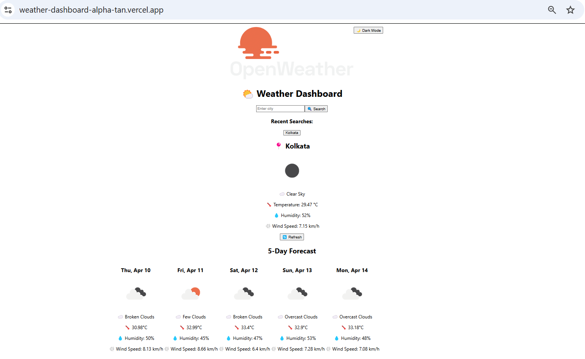

# 🌤️ Weather Dashboard

A clean and responsive weather dashboard built with **React.js (Vite)** and **Tailwind CSS**, fetching real-time weather data using the **OpenWeatherMap API**.



---

## 🚀 Live Demo

🌐 **Live App**: [https://weather-dashboard-alpha-tan.vercel.app](https://weather-dashboard-alpha-tan.vercel.app)

---

## 🛠️ Tech Stack

- **Framework**: [React.js](https://reactjs.org/) (via [Vite](https://vitejs.dev/))
- **Styling**: [Tailwind CSS](https://tailwindcss.com/)
- **Animations**: [Framer Motion](https://www.framer.com/motion/)
- **Deployment**: [Vercel](https://vercel.com/)
- **API**: [OpenWeatherMap](https://openweathermap.org/)

---

## 📦 Features

- 🔍 Search for current weather by **city name**
- 🌡️ Displays temperature, humidity, wind, and condition icon
- 🕐 Shows 5-day forecast (midday snapshots)
- 💾 Recent search history (last 5 cities)
- 🌙 Light/Dark theme toggle
- 🔄 Refresh weather button
- ⏳ Loader spinner during fetch
- ❌ User-friendly error handling
- 🎨 Smooth animations via Framer Motion
- 📱 Fully responsive for mobile & desktop

---

## ⚙️ Setup Instructions

```bash
# Clone the repository
git clone https://github.com/Chinmoyee123/weather-dashboard.git
cd weather-dashboard

# Install dependencies
npm install

# Create your environment variable file
cp .env.example .env
# Paste your API key into .env
